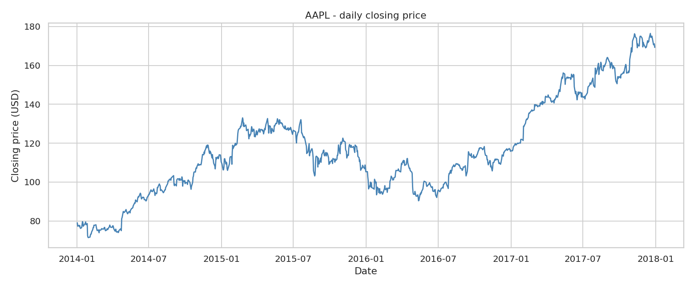
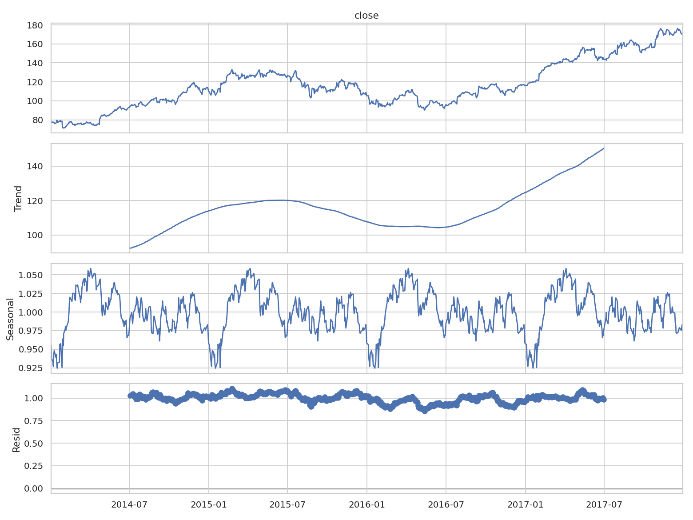
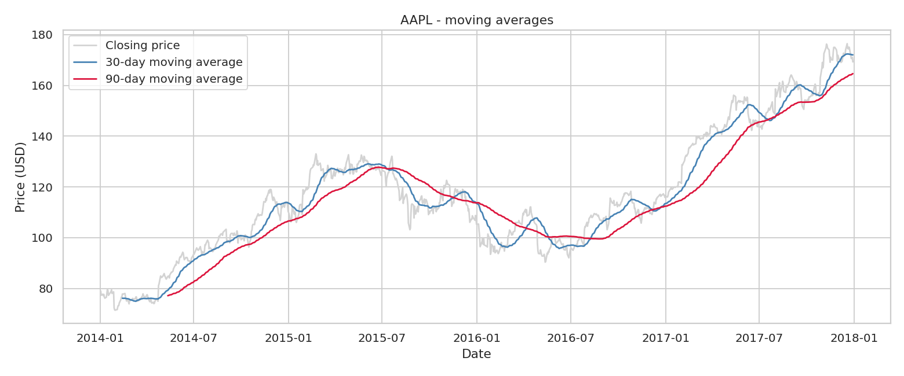
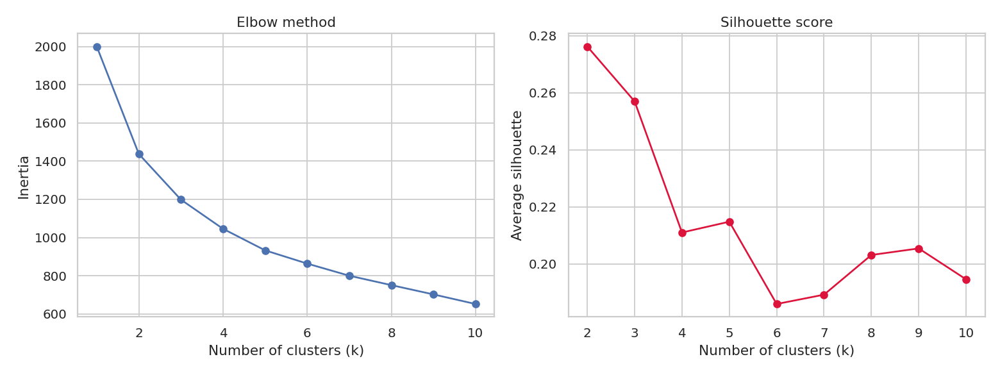
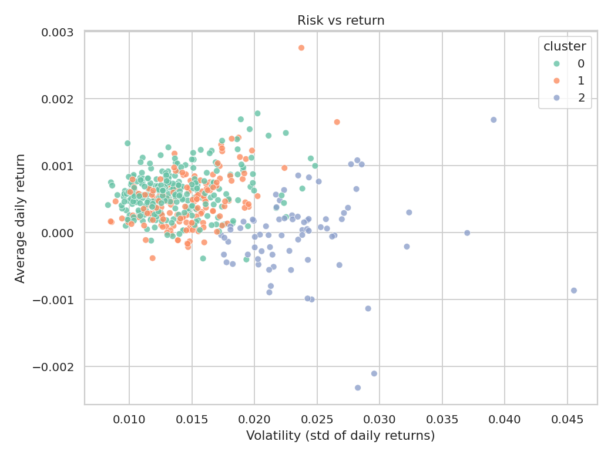
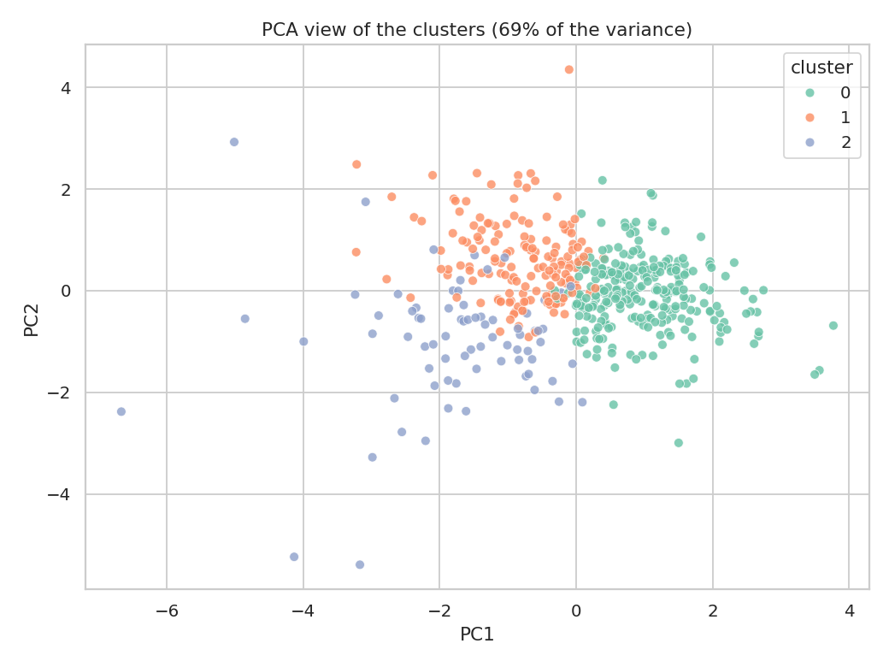

# Codveda Data Analytics Internship - Level 2

This is my work for Level 2 of the Data Analytics track at Codveda. The brief asks for two tasks out of three, so I did **Task 2 (time series analysis)** and **Task 3 (K-Means clustering)**.

Both tasks use the same file: daily prices (open, high, low, close, volume) for 505 large US companies, from January 2014 to December 2017. It looks like the S&P 500 list but I could not confirm that.

## What's in the folder

```
Level2_Tasks_2_and_3.ipynb      the same analysis as a notebook, charts inline
data/
    raw/                        put the original csv here (not included, it is 24 MB)
    stock_prices_clean.csv      the cleaned file, made by step 1
src/
    01_clean_data.py
    02_time_series_analysis.py
    03_kmeans_clustering.py
figures/                        all the charts used below
results/
    cluster_summary.csv         average profile of each cluster
    stock_clusters.csv          the cluster of every stock
requirements.txt
```

## How to run it

```
pip install -r requirements.txt
python src/01_clean_data.py
python src/02_time_series_analysis.py
python src/03_kmeans_clustering.py
```

Run them from the main folder. If you only want to look at the analysis, the cleaned csv is already in `data/`, so you can skip step 1. The notebook `Level2_Tasks_2_and_3.ipynb` does steps 2 and 3 in one place, open it from the main folder too because it reads `data/stock_prices_clean.csv`.

## Cleaning the data

The raw file had 497,472 rows. I removed 14 of them and the cleaned file has 497,458 rows.

- 11 rows had a missing open price (8 of them also had no high and low). I dropped them instead of guessing prices.
- 3 rows had prices that cannot be right: AOS on 2014-05-19 has a high lower than its low, CHD on the same day opens at 18.77 while the stock traded around 34, and LNT on 2016-05-19 closes at 17.87 while it traded around 35.
- No duplicated rows (same stock, same day).

A few things I noticed and left as they are. Nine rows have the open or close slightly outside the day's range, which can happen on spin-off or dividend days. And the prices are not adjusted for splits or spin-offs, so some days look like a crash when they are not (more on that at the end).

## Task 2 - time series analysis

I picked AAPL because it has all 1,007 trading days with no gap, and it is easy to check the story against what happened to the company.



The price goes up in 2014 (+39.7%), flat to down in 2015 (-3.7%), slowly recovers in 2016 (+9.9%) and then climbs a lot in 2017 (+45.7%, ending around 169 USD). The highest point of 2015 is 133 USD and the lowest of 2016 is 90 USD.

For the decomposition I used `seasonal_decompose` from statsmodels with a multiplicative model, because the moves get bigger when the price is higher, and a period of 252 trading days (about a year).



The trend shows the same up, down, up shape as the raw price. It stops before the start and end of the series because a centred 252-day average cannot be computed at the edges. The seasonal factor goes from 0.925 to 1.058, high in the first months of the year and low around December. The residuals have a standard deviation of 0.047.

I wanted to check that seasonal part another way, so I also averaged the return of each calendar month. February (+6.7%), October (+6.4%) and May (+6.1%) are the best months and December (-3.7%) and June (-2.7%) the worst. But each bar is an average of only four values (one per year), so I would not call this proven seasonality. It is a hint at best.

For the moving averages I used 30 and 90 days.



The 30-day line follows the price closely. The 90-day line is smoother but reacts later, you can see it at the 2015 peak and the 2016 bottom. The price is mostly above both lines during the 2014 and 2017 rises and goes under them during the fall of 2015-2016.

As an extra I ran an Augmented Dickey-Fuller test. The closing price is not stationary (p = 0.88), the daily returns are (p < 0.001). That is the usual reason people model returns instead of prices.

## Task 3 - clustering with K-Means

Here every stock is one point. I described each stock over the four years with four numbers: average daily return, volatility (standard deviation of the daily return), average daily volume and average closing price. I took the log10 of volume and price because both have a few very big values. Five stocks with less than 250 days of data were left out, which leaves 500.

The features are on very different scales (volatility is around 0.015 and log volume around 6), so I standardized them with `StandardScaler` before running K-Means.



For the number of clusters I looked at the elbow curve and at the silhouette score. The inertia falls fast until k = 3 and then more slowly. The silhouette is best at k = 2 (0.276) and k = 3 (0.257), then drops (0.211 at k = 4). k = 2 seemed too coarse to say much, so I went with **k = 3**.



The clusters, numbered from the calmest to the most volatile:

| Cluster | Stocks | Avg daily return | Volatility | Avg volume | Avg price | Some tickers |
|---|---|---|---|---|---|---|
| 0 | 265 | 0.059% | 1.38% | 1.6M | 120 USD | WYN, COL, TAP, NTRS, SBAC, CME, PH, EL |
| 1 | 161 | 0.047% | 1.46% | 8.0M | 47 USD | BK, EXC, ABT, BBT, CCL, NKE, ICE, CTSH |
| 2 | 74 | -0.004% | 2.38% | 5.6M | 50 USD | KORS, STX, CF, NWL, DVN, OKE, KSS, UAA |

Cluster 0 is the expensive and quiet stocks (high price, low volume, low volatility, best average return). Cluster 1 is the heavily traded, cheaper stocks with low volatility. Cluster 2 is the risky group: the most volatile and with a slightly negative return, with a mix of energy or commodity companies and retail or clothing brands.



## Limits

- The silhouette score of 0.26 is not high. The clusters overlap a lot in the charts, so they are tendencies and not clear borders. The difference in average return between clusters is also small compared to the daily noise.
- The prices are not adjusted for splits and spin-offs. Some one-day drops of 40 to 60% in the data (DISCA and DISCK in August 2014, EBAY, NI and BAX in July 2015) look like corporate events and not real crashes. They make the volatility of these stocks look bigger than it is. I left them in, the script prints the list, and fixing it would need adjusted prices. The jumps of AMD and VRTX look real to me, but I did not check every case.
- Task 2 uses one stock and four years, so the seasonality part is weak evidence.
- Price level as a clustering feature is a bit arbitrary, since it depends on how many times a company split its shares.
- This is a school exercise on past data, not investment advice.

## Author

Fortuné Assouan - Information Systems student, Lomé Business School (Togo).
Codveda Technology, Data Analytics internship.
