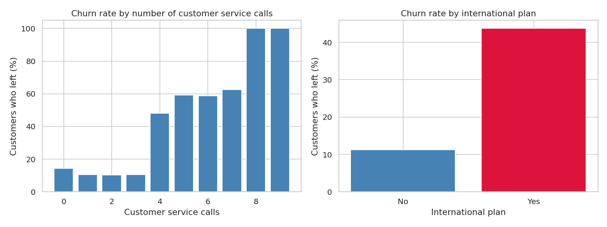
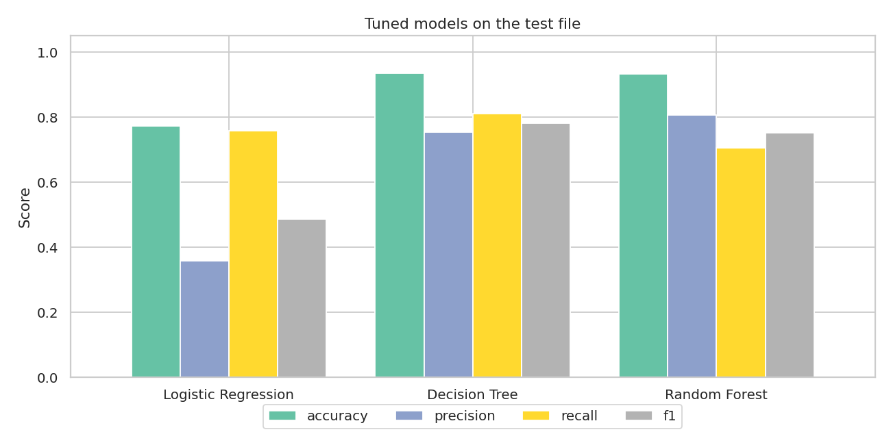
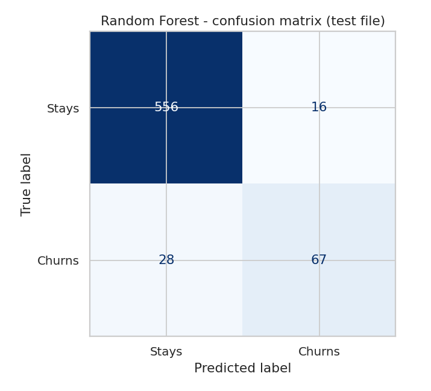
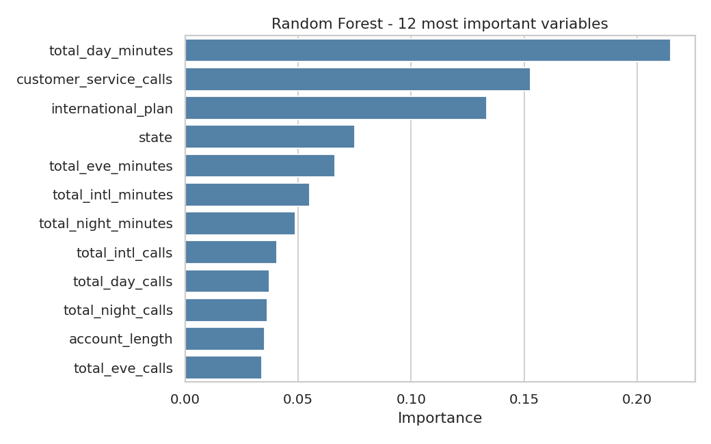
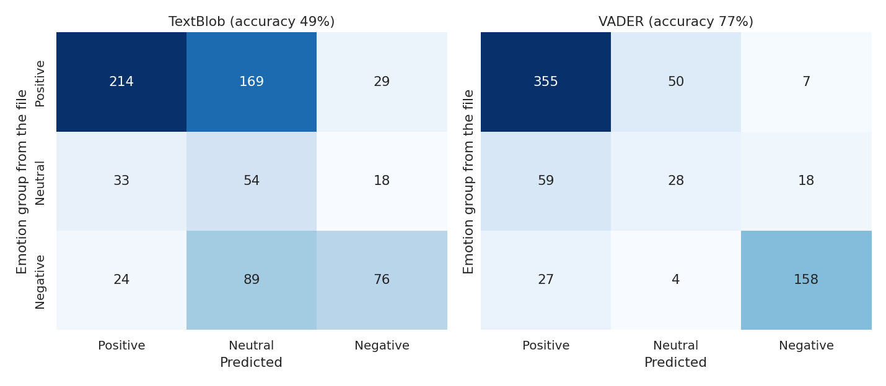
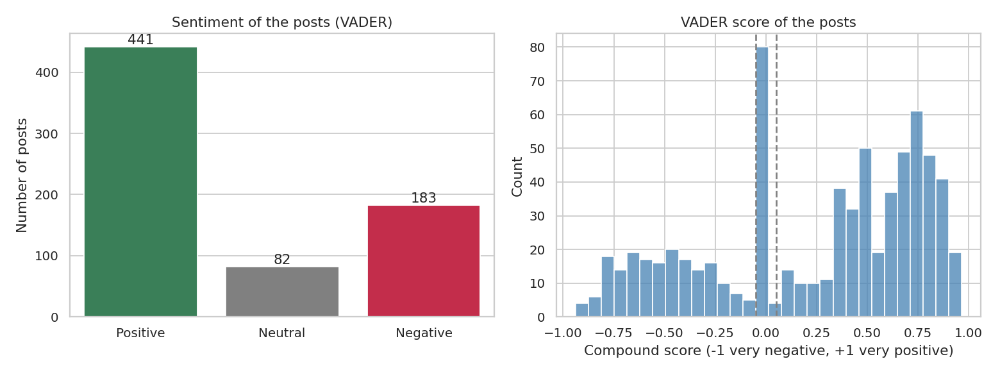

# Codveda Data Analytics Internship - Level 3

This is my work for Level 3 of the Data Analytics track at Codveda. I did **Task 1 (predictive modelling, classification)** on a telecom churn dataset and **Task 3 (NLP, sentiment analysis)** on social media posts.

## What's in the folder

```
Level3_Tasks_1_and_3.ipynb      both tasks in one notebook, charts inline
data/
    raw/                        the three original csv files
    churn_train_clean.csv       cleaned churn data (80% file, used to train)
    churn_test_clean.csv        cleaned churn data (20% file, used to test)
    sentiment_clean.csv         cleaned social media posts
src/
    01_clean_data.py
    02_churn_classification.py
    03_sentiment_analysis.py
figures/                        all the charts used below
results/
    churn_model_comparison.csv  scores of every model, default and tuned
    churn_best_params.csv       best grid search parameters
    sentiment_scored.csv        every post with its TextBlob and VADER scores
    emotion_mapping.csv         how I grouped the 191 emotions into 3 classes
requirements.txt
```

## How to run it

```
pip install -r requirements.txt
python src/01_clean_data.py
python src/02_churn_classification.py
python src/03_sentiment_analysis.py
```

Run the scripts from the main folder. The first run of the sentiment script needs an internet connection because nltk downloads its word lists. The cleaned files are already in `data/`, so step 1 can be skipped. To use the notebook, open `Level3_Tasks_1_and_3.ipynb` from the main folder (it reads the files in `data/`).

## Cleaning the data

**Churn files.** No missing values, no duplicated rows, and no row shared between the two files (that would have been a leak). I only renamed the columns (`Total day minutes` became `total_day_minutes`) and changed `Churn` from True/False to 1/0.

**Sentiment file.** This one needed more work:

- Nearly every text column was padded with spaces. After stripping them there are 33 countries instead of 115 spellings, 3 platforms instead of 4, and 191 emotions instead of 279.
- 26 posts had the same text as another one. I removed them, which leaves 706 posts out of 732.
- Two leftover index columns were dropped, timestamps were parsed and likes/retweets were turned into integers.
- The column called `Sentiment` does not hold positive/negative/neutral. It holds 191 different emotions (Joy, Grief, Nostalgia...). I renamed it `emotion` so it does not get mixed up with the sentiment I compute.

## Task 1 - churn classification

The data is 2,666 customers to train on and 667 to test on. Only 14.6% of them churn. That changes how the results must be read: a model that always answers "stays" would be right 86% of the time and find nobody. So I look at precision, recall and F1 of the churn class and not only at accuracy.

A first look at the training data shows two clear patterns.



The churn rate stays around 10-14% up to 3 calls to customer service, then it jumps to 48% at 4 calls and above 58% after. Customers with an international plan leave at 43.7%, against 11.3% for the others.

**Preprocessing.** The four charge columns are the minutes multiplied by a fixed price (correlation of 1.00), so I dropped them. `state`, `area_code` and the two plans are one-hot encoded (`area_code` is a number in the file but it is really a label). Numeric variables are standardized. I used `class_weight="balanced"` on every model because of the imbalance.

**Models.** Logistic Regression, Decision Tree and Random Forest, first with default settings and then tuned with `GridSearchCV` (5-fold cross-validation on the training file, scored with the F1 of the churn class). The test file was only used at the end.

| Model | F1 default | F1 tuned | Precision (tuned) | Recall (tuned) | ROC AUC (tuned) |
|---|---|---|---|---|---|
| Logistic Regression | 0.495 | 0.486 | 0.358 | 0.758 | 0.828 |
| Decision Tree | 0.720 | 0.782 | 0.755 | 0.811 | 0.895 |
| Random Forest | 0.629 | 0.753 | 0.807 | 0.705 | 0.919 |



The logistic regression catches many churners but raises a lot of false alarms (precision 0.36) and tuning does not help it. The trees do much better. Tuning helped the decision tree (F1 0.72 to 0.78) and it especially helped the random forest, which went from missing more than half of the churners (recall 0.46) to finding 71% of them.

I chose the final model with the cross-validation score and not with the test score, to keep the test file as a fair exam. That gives the **random forest** (CV F1 0.785, against 0.752 for the tree). On the test file the decision tree has a slightly higher F1 (0.78 against 0.75), but there are only 95 churners in it, so I would not put much weight on a gap this size.

On the test file the random forest gets an accuracy of 0.93 (the "always stays" model gets 0.86), a precision of 0.81 and a recall of 0.71. In numbers: 67 churners found, 28 missed, 16 false alarms.



The most important variables for the forest are the daytime minutes, the number of customer service calls and the international plan.



The last two match the first chart. For the minutes, the 20% of customers who talk the most during the day (more than about 224 minutes) leave at 33%, against 7 to 14% for the rest. So the profile to watch is: heavy day-time users, customers who called support 4 times or more, and customers with an international plan.

## Task 3 - sentiment analysis

**Preprocessing.** Lower case, removal of links, mentions, digits and hashtag signs, then tokenization, stopwords removal and lemmatization with nltk. The stopwords are only removed for the word analysis. For the sentiment scores I keep them, because words like "not" change the meaning.

**Two tools.** I scored each post with TextBlob and with VADER (the sentiment tool inside nltk, built for short social media text). Both give a score from -1 to +1 and I call a post neutral when it is within 0.05 of zero. They agree on only 49.9% of the posts, so I needed a way to choose.

**Checking them.** As said above, the file has no positive/negative/neutral column. To have a reference I grouped the 191 emotions by hand (Joy, Gratitude, Excitement... positive, Despair, Anger, Grief... negative, and Nostalgia, Surprise, Curiosity, Acceptance... neutral). This is my own judgment and some emotions are debatable, so the whole mapping is in `results/emotion_mapping.csv`.



VADER agrees with the grouped emotions on 76.6% of the posts, TextBlob on 48.7%. If I only keep the clearly positive or clearly negative emotions (so my choices on the debatable ones do not count), it is 85.4% against 48.3%. VADER is weak on the neutral class (F1 0.30), which is also where the grouping is the most debatable.

To see why TextBlob fails, I looked at positive posts it calls negative. "Feeling grateful for the little things in life" gets -0.19 from TextBlob because "little" has a negative score in its dictionary, and VADER gives it 0.54. The same happens with words like "late" or "mental". So **VADER is the sentiment used in the rest of the analysis.**



62.5% of the posts are positive (441), 25.9% negative (183) and 11.6% neutral (82). The scores are pushed to the two ends, which is normal for short posts that express a clear feeling. The three platforms look alike (60 to 65% positive). Twitter is slightly more negative (28.1%) but with about 235 posts per platform I would not read much into it.


Positive posts are full of words like joy, friend, laughter, adventure, dance and beauty. Negative posts are dominated by despair, lose, shatter, loneliness, betrayal and frustration. The word "life" is frequent in both, a reminder that a word cloud shows what people talk about and not always how they feel about it.

## Limits

- The accuracy figures for the sentiment tools depend on my own grouping of the emotions. The gap between VADER and TextBlob is large enough to hold whatever I decide for the debatable ones, but the exact percentages are indicative.
- The posts are short single sentences with a clear feeling. Long, messy or sarcastic posts would be harder, and both tools would probably fail on sarcasm.
- 706 posts is small, and the differences between platforms are within what chance can produce.
- The churn model tells who is likely to leave, not why. A customer who calls support many times may leave because of the problem that made him call.
- The churn data is a public dataset, so I have no way to check if the patterns would hold for another operator or another period.
- This is a school exercise on public datasets, not a production model.

## Author

Fortuné Assouan - Information Systems student, Lomé Business School (Togo).
Codveda Technology, Data Analytics internship.
